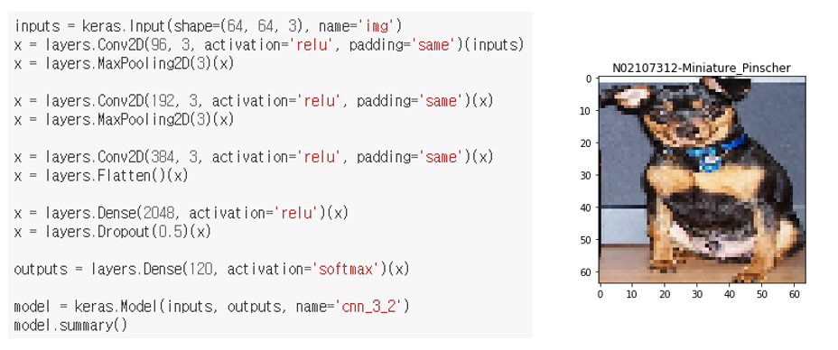
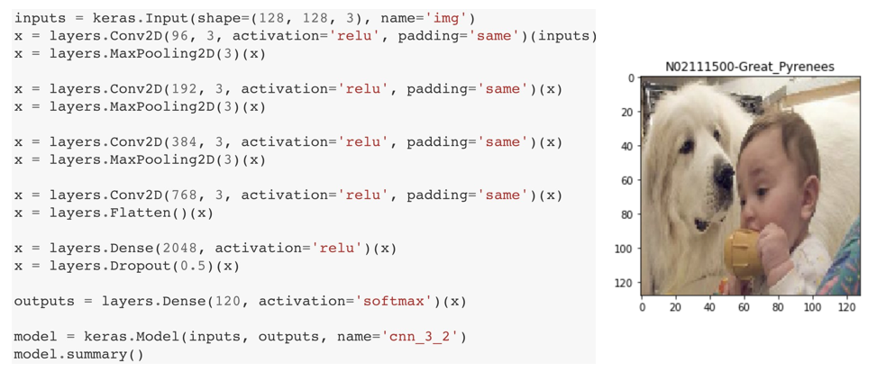
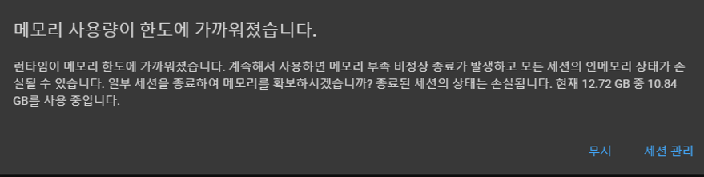
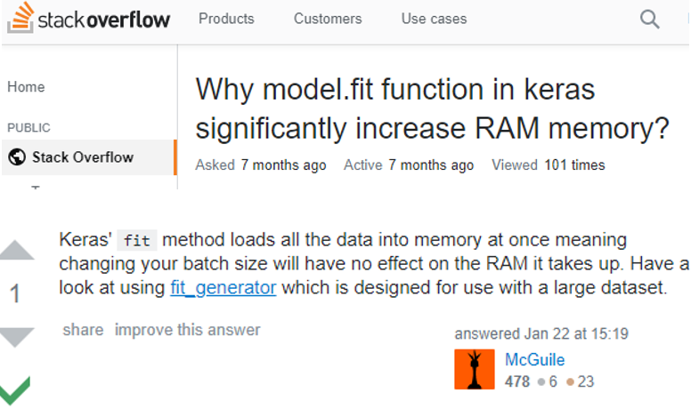

# ABR-Lab-Summer-Project
## Dataset 선정 : Stanford Dog Breed 

image dataset을 정하여 CNN 모델을 적용하여 학습시켜 보는 것이 이번 과제의 목표이다. 처음에는 ```intel image classification``` dataset을 학습해보려 하였으나, label이 6개 밖에 되지 않는 데이터 셋이어서 label이 더 많은 dataset을 사용하기로 하였다. ```cifar 100``` 과 ```stanford dog breed dataset``` 중 고민을 하였다. `CIFAR100`에 비해 Dog Breed 데이터셋이 이미지 크기는 크고, 라벨의 개수가 많은 반면 데이터의 수가 적어 학습이 힘들 것이라 예상하였다. 하지만 Dog Breed 데이터의 분류 문제는 1학기 과제로 나왔었고, 이를 끝까지 완성하지 못하였던 것이 아쉬웠다. 이러한 이유로 ```standford dog breed dataset```을 학습시켜보기로 결정하였다.

## Tensorflow 2.0
tf2.png)
```tensorflow```와 ```keras```가 통합되고, ```tensorflow```에서도 고수준의 API들이 지원되면서, 기존의 Placeholder, Session, feed_dict 구조의 기존의 ```tensorflow``` 코드가 더이상 지원되지 않을 것이라는 경고(deprecated)를 많이 보게 되었다. 따라서 이번 기회에 ```tensorflow 2.0```와 이에 내장된 `keras`의 API을 활용해서 개인 프로젝트 과제를 수행해보기로 하였다.


## CIFAR10-fastai
```ciafr 10```, ```cifar 100```의 모델에 따른 정확도에 대하여 조사하면서 `ResNet`, `Inception`, `EfficientNet`, `MobileNet`등의 향상된 CNN 모델을 새로 알게 되었고, `ResNet`과 `Inception`은 `keras`나 `fastai`의 내장 모델로 구현되어 있다는 사실을 알게되었다. 매우 간결한 코드로 모델을 학습시켜볼 수 있는 `fastai`라는 모듈에 흥미가 생겨, `fastai`에 구현되어있는 모델들을 활용하여 `cifar 10` dataset을 높은 accuracy로 학습시켜 보고자 하였다.


## Tensorflow 2.0 tutorial
tf2_keras.png)
[Image_Data_loading_and_preprocessing](https://www.tensorflow.org/beta/tutorials/load_data/images)은 `tensorflow 2.0`의 이미지 데이터 로드 및 전처리에 대한 튜토리얼이다. 이 문서를 읽어보면서, ```tensorflow 2.0```의 이미지 데이터 로딩과 처리에 대한 튜토리얼을 따라하며 새로워진 기본 문법과 ```tf.keras``` 라이브러리에 대하여 알게되었다. `fastai`에서와 같이 모델 객체를 구현하고, `.fit()`이라는 method를 통해서 학습을 시키고, 학습데이터를 `feed_dict` 대신 함수의 인자로 데이터 전달하며, `.evaluate()` method를 통해서 test, 평가한다. 
더불어 이미지 데이터를 `numpy array`가 아닌 `Tensor`형의 데이터로 다루는 것도 새로웠다.

## Crop with Annotation
dogbreed.png)
실제로 적용하는데에 학습 모델을 만드는 것은 tf.keras 모듈을 통해서 쉽고 직관적으로 만들 수 있었다. 오히려 더 다루기 어려웠던 것은 내가 사용하고자 하는 데이터를 학습모델에 적용할 수 있도록 전처리하는 것이었다. 특히 Dog Data는 Imagenet 데이터의 부분집합이어서, 이미지 데이터에서 개의 부분만을 뽑아내기 위해서 Annotation xml 파일을 읽어들여 원래의 이미지에서 cropping을 하는 전처리가 필요하다. 따라서 tensorflow.data를 이용하여 이미지 파일로 부터 numpy array가 아닌, 각 이미지의 경로를 저장한 문자열 자료의 텐서의 dataset 객체를 만들고, tf.map 함수에 전처리 함수와 dataset 객체를 넘겨 cropping, resizing을 한 dataset을 만들려고 하였다. 

데이터 전처리 함수에 tf.map함수를 통하여 문자열이 포함된 텐서형의 자료를 넘겨주었을 때, 전처리 함수에서 문자열 연산을 취하지 못하는 문제가 발생하였다. 기존에는 데이터로부터 tensorflow dataset을 만들 때 image cropping을 해주었으나, 이것이 불가능하게 되어 crop된 이미지 데이터를 모두 생성하고, Google Drive에 저장하여, 이를 불러와서 사용하는 형태로 바꾸었다.


## Dog Breed - simple cnn

앞에서 소개한 튜토리얼(Image Data loading and preprocessing)의 코드를 활용하여 Stanford Dog Breed Data 에 맞도록 적용하여 간단한 cnn모델을 적용해 보았다. CIFAR 데이터셋의 이미지가 32 X 32인 것에 착안하여, 먼저 이미지의 크기를 줄여서 학습을 시켜보았다. 64 x 64 로 resize한 이미지를 입력으로 받는 간단한 CNN 모델 구성을 구성하여 학습시키고 성능을 평가하여 보았다. 
그 결과 10번의 epoch만에 오버피팅이 나타났으며, 최종 정확도 약 20%가 도출되었다.


## Dog Breed - larger size

64 x 64 보다 더 큰 128 x 128 로 resize한 이미지를 사용하여 학습 데이터의 양을 더 크게하여 학습시켜보았다. 입력 이미지의 사이즈를 2x2배 늘리면서, 증가한 문제의 복잡도에 따라 모델의 복잡도를 증가시키고, 모델의 균형을 맞추기 위해 컨볼루션 레이어도 추가하였다.
결과 최종 정확도 약 24%로 64 x 64 사이즈로 학습했을 때 보다 정확도가 더 높아진 것을 확인할 수 있다. 이미지의 사이즈가 커진 만큼 더 많은 정보를 학습시킬 수 있었기 때문일 것으로 판단된다.


## Dog Breed - Better Models
CIFAR 10, CIFAR 100의 accuracy에 대해 조사하면서 ResNet, Inception, MobileNet 등의 모델들과 EfficientNet, MixNet과 같은 최신 모델들에 대해 알게되었다. 이 모델들에 맞도록 이미지를 (224, 224)의 크기로 resize하여, 여러 모델을 적용해 학습시켜보고자 하였다. 하지만 이전의 학습 모델 코드에서 입력 데이터 사이즈와 모델 구조만 바꾸고 학습을 진행하려하였을 때 문제가 발생하였다. 


이미지의 사이즈가 224 x 224로 기존의 64 x 64 데이터보다 크기가 훨씬 커져 model.fit()을 실행시켰을 때 학습이 시작되기 전 데이터를 로딩하다가 램 용량을 초과한다. 이는 `keras`의 `model.fit()`의 구현 특징 상의 문제이다. `model.fit()`을 실행하면 학습이 시작되기 전, 학습에 필요한 모든 데이터를 램에 적재하고 시작한다. 이로 인해 램 용량이 부족한 사태가 발생한다. 
이를 해결하기 위해서는 `model.fit_generator()`를 사용해야한다. `model.fit_generator()`는 학습 데이터를 배치단위로 파이프라이닝하여 한번에 모든 데이터를 메모리에 적재하지 않고, 배치단위로 메모리에 적재한다.


## DogBreed_ResNet
generator 객체를 생성할 때, flow_from_dataframe 메소드의 경우 pandas 데이터프레임이어야 하므로 flow_from_directory를 사용하기로 하였다. flow_from_directory를 사용하기 위해서는 train, validation, test 디렉토리가 따로 존재해야한다.
https://stackoverflow.com/questions/54311198/why-model-fit-function-in-keras-significantly-increase-ram-memory
### Shuffle_and_Split_Data
crop된 이미지들로 부터 train, validation, test 데이터로 나누어 Google Drive에 저장하였다.

gg
